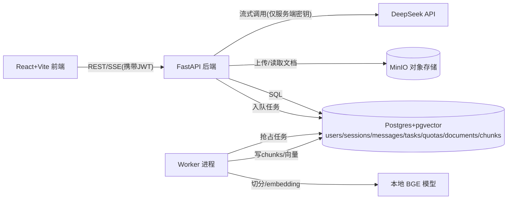

## 产品概述

从零搭建一个"带权限的内部知识问答 Agent"：用户登录后上传内部文档，系统异步完成切分与向量化入库；用户在会话中提问，服务端经 RAG 召回后调用 DeepSeek 生成答案并以 SSE 流式返回，答案附引用且可点击高亮跳回原文。系统具备生产态能力：任务超时/重试/死信、降级、traceId 全链路、费用统计、提示词注入防护样例、工具调用人工确认。

## 核心功能

- 登录鉴权：JWT 登录，按用户隔离会话、文档与配额
- 流式对话：服务端 SSE 代理 DeepSeek（前端禁止直连模型），前端打字机渲染、停止生成、失败态展示
- RAG 最小闭环：文档上传至 MinIO → 任务表驱动异步切分（参数可配）→ 本地 BGE embedding → pgvector 入库 → 召回注入 → 引用回跳原文
- 工具人工确认：敏感工具（如删除文档）由 LLM 发起 tool_call，前端弹窗确认后才执行
- 生产态：任务超时/指数退避重试/死信、模型超时降级、traceId 贯穿 SSE/任务/费用、按 token 累计费用并展示配额角标、一条提示词注入防护样例
- 评测与收口：30 条评测问句，切分参数调整前后指标可升可降；README、.env.example、两分钟录屏脚本、评测表、费用记录、三篇系统设计文档（对话系统/知识库问答/异步任务）

## 视觉与交互效果

深色侧边栏 + 浅色主区的专业工具风；消息流打字机逐字出现；引用以角标呈现，点击右侧滑出原文面板并高亮对应段落；工具确认居中弹窗；失败消息红色内联卡片可重试；右上角配额角标实时显示 token 用量。

## 技术栈

- 后端：Python 3.12 + FastAPI + SQLAlchemy 2.x（async）+ Alembic + pgvector + sse-starlette + httpx（调 DeepSeek）+ sentence-transformers（本地 BGE-small-zh-v1.5）+ minio SDK + PyJWT + passlib[bcrypt]
- 前端：React 18 + Vite + TypeScript（strict 全开）+ zod + openapi-typescript（由 FastAPI /openapi.json 生成类型）+ react-router + Tailwind + shadcn
- 基础设施：docker-compose 编排 postgres(pgvector/pg16)、minio(含建桶初始化)、backend、worker、frontend(nginx)
- 模型：DeepSeek（OpenAI 兼容、stream=true、返回 usage）；embedding 本地 BGE（DeepSeek 无 embedding API，且与全本地策略一致）

## 实现方案

### 总体策略

前后端分离 monorepo。FastAPI 同时承担 REST CRUD 与 SSE 流式端点；独立 worker 进程轮询 tasks 表执行切分/向量化任务（不引入 Celery/Redis，降低复杂度，同时天然支持超时、重试、死信的状态机演示）。

### 关键决策

- **契约对齐**：Pydantic schema 即 OpenAPI 来源 → openapi-typescript 生成 TS 类型 → 前端对 SSE/REST 响应用 zod 解析（z.infer 与生成类型对齐），SSE 事件采用可辨识联合（type 字段），unknown 收窄后再消费
- **SSE 读取**：前端用 fetch + ReadableStream（而非 EventSource），原因：需要携带 Authorization 头、需要 AbortController 停止生成；按 `data:` 行手动解析事件流
- **RAG 召回**：chunks.embedding 为 vector(512)，IVFFlat 索引；召回 top-k 后注入 prompt，SSE 单独推送 citation 事件（chunk_id + 文档定位），前端按 chunk_id 回查原文并高亮
- **任务状态机**：pending → running → done/failed（重试次数+指数退避）→ dead（超过 max_retries）；worker 用 `UPDATE ... SET status='running' WHERE id=(SELECT ... FOR UPDATE SKIP LOCKED)` 抢占任务，避免重复执行
- **费用**：DeepSeek 流式末尾返回 usage，按价目表折算写入 quotas（累计 tokens 与费用），traceId 关联每次调用，前端角标轮询/随 SSE 刷新
- **降级**：模型调用 httpx 超时（如 60s）→ SSE 发送 error 事件 + 兜底文案；embedding 失败 → 文档标记 failed 并可重试
- **工具确认**：tool_call 不落执行，写入 messages(status=pending_confirm)，前端弹窗确认后调用确认端点才执行，全链路留痕
- **注入防护**：召回文本包裹分隔符 + 系统提示声明其为数据非指令；内置一条"忽略之前指令"样例文档用于演示拦截与留痕

### 性能与可靠性

- 切分与 embedding 批量化（每批 32 chunk），避免逐条 encode；召回为单次向量查询 O(log n) 级（IVFFlat）
- SSE 连接与 DB 会话解耦：流式期间不复用长事务，usage 在流结束后一次性落库
- 文档入库失败可重放（同一 document 重新入队），chunk 写入以 document_id 事务包裹保证一致性

## 实施注意

- TypeScript 开启 strict、noUncheckedIndexedAccess；所有外部输入（SSE 行、REST 响应、localStorage）先 zod 解析
- 密钥（DEEPSEEK_API_KEY、JWT_SECRET）仅存在于 backend/worker 环境变量，前端仓库零密钥；提供 .env.example
- 日志统一 JSON 格式含 traceId，由中间件生成并透传到 worker 与 SSE 事件；不记录文档正文与密钥
- Windows 开发：sentence-transformers 首次运行下载 BGE 模型，compose 中挂载缓存卷；行尾与脚本兼容 PowerShell

## 架构设计



## 目录结构

```
web-agent/
├── docker-compose.yml            # [NEW] 编排 postgres/pgvector、minio+建桶、backend、worker、frontend
├── .env.example                  # [NEW] 全部环境变量示例（无真实密钥）
├── README.md                     # [NEW] 架构图、快速开始、四问（数据/失败/费用/评测）与证据索引
├── backend/
│   ├── pyproject.toml            # [NEW] 依赖与工具配置（ruff/pytest）
│   ├── alembic/                  # [NEW] 迁移脚本：7 张表 + vector 扩展 + IVFFlat 索引
│   ├── app/
│   │   ├── main.py               # [NEW] FastAPI 入口、traceId 中间件、路由注册、异常处理
│   │   ├── config.py             # [NEW] pydantic-settings 读取环境变量
│   │   ├── models/               # [NEW] SQLAlchemy 模型：user/session/message/task/quota/document/chunk
│   │   ├── schemas/              # [NEW] Pydantic schema（OpenAPI 来源，含 SSE 事件模型）
│   │   ├── api/                  # [NEW] auth、sessions、messages、chat(SSE)、documents、quotas、tools/confirm
│   │   ├── services/             # [NEW] deepseek 客户端(超时/重试/usage)、embedding、chunking、rag、cost
│   │   └── core/                 # [NEW] JWT 鉴权、traceId、统一错误
│   ├── worker/main.py            # [NEW] 任务循环：抢占、超时、指数退避重试、死信
│   └── eval/                     # [NEW] 30 条评测问句与评测脚本（召回命中率/回答正确率，输出对比表数据）
├── frontend/
│   ├── package.json / vite.config.ts / tsconfig.json  # [NEW] strict 全开，代理 /api
│   ├── src/
│   │   ├── api/                  # [NEW] openapi-typescript 生成类型 + zod schema + fetch 封装
│   │   ├── hooks/useSSE.ts       # [NEW] fetch+ReadableStream 解析 SSE、AbortController 停止、错误态
│   │   ├── pages/                # [NEW] Login、Chat（含文档管理侧栏）
│   │   └── components/           # [NEW] MessageList、Typewriter、CitationPanel、ToolConfirmDialog、QuotaBadge、ErrorCard
└── docs/
    ├── system-design/            # [NEW] 对话系统/知识库问答/异步任务三篇（STAR + 四问）
    └── evidence/                 # [NEW] 评测前后对比、traceId 完整追踪、超时进死信记录、回滚说明、录屏脚本
```

## 关键代码结构

```ts
// SSE 事件可辨识联合（前端 zod schema 与后端 Pydantic 模型一一对应）
type ChatEvent =
  | { type: "delta"; traceId: string; content: string }
  | { type: "citation"; traceId: string; chunkId: string; documentId: string; snippet: string }
  | { type: "tool_call"; traceId: string; toolCallId: string; name: string; args: unknown }
  | { type: "usage"; traceId: string; promptTokens: number; completionTokens: number; cost: number }
  | { type: "error"; traceId: string; code: "TIMEOUT" | "MODEL_ERROR" | "ABORTED"; message: string }
  | { type: "done"; traceId: string; messageId: string };
```

```python
# 任务状态机（worker 依据状态与 retry_count/next_run_at 调度）
TaskStatus = Literal["pending", "running", "done", "failed", "dead"]
```

## 设计风格

企业级知识工具的极简专业风：深色侧边栏（导航+文档管理）与浅色对话主区形成层次，玻璃拟态用于弹窗与引用面板，克制使用靛蓝主色引导关键动作。全站微动效：消息入场淡入上移、打字机光标呼吸、引用 hover 浮现摘要、按钮按压反馈。

## 页面规划（2 页）

### 1. 登录页

- 品牌块：左侧渐变品牌区，产品名与一句话价值主张，弱化装饰纹理
- 表单块：右侧卡片式登录表单，用户名/密码输入带聚焦描边，错误 shake 动效与内联提示
- 状态块：登录中按钮 loading，失败展示服务端错误；演示账号提示条
- 页脚块：版本号与 traceId 占位（便于演示追踪）

### 2. 对话主界面

- 侧边栏：会话列表（新建/切换/删除），下方文档管理区（上传进度、切分状态徽标），底部用户信息与配额角标
- 对话区：消息流区分用户/助手气泡，助手消息打字机渲染，引用以 [1] 角标内联；失败消息红色 ErrorCard 可重试；流式中显示停止按钮
- 引用面板：点击角标右侧滑出抽屉，展示原文并按 chunk 高亮，支持关闭与多引用切换
- 工具确认弹窗：玻璃拟态居中弹窗，展示工具名与参数 JSON，确认/拒绝按钮，操作留痕提示
- 输入区：底部固定输入框，支持 Enter 发送，禁用态（流式中/额度耗尽）明确可见

## Agent Extensions

### Skill

- **xlsx**
- Purpose：将评测脚本输出的 30 条问句结果制作成评测对比电子表格（两组切分参数下的召回命中率与回答正确率，前后对比、逐条明细）
- Expected outcome：docs/evidence/ 下生成可交付的评测表 xlsx，数字满足"改切分后能升能降"，作为作品收口证据之一